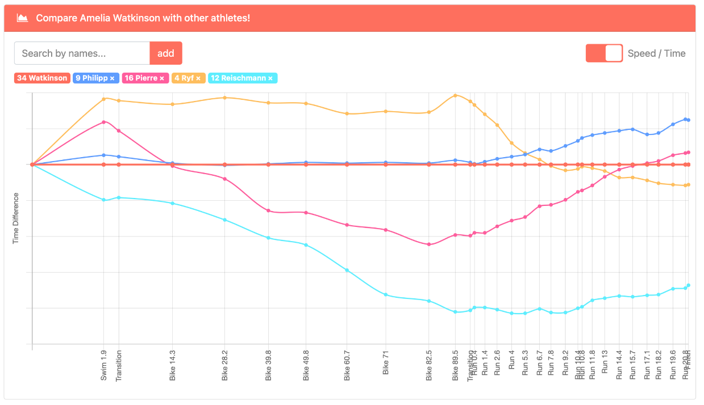
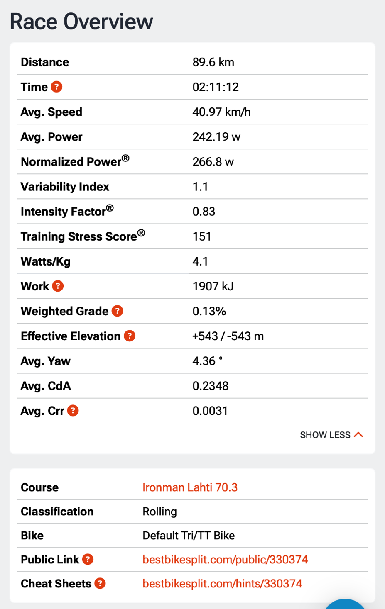
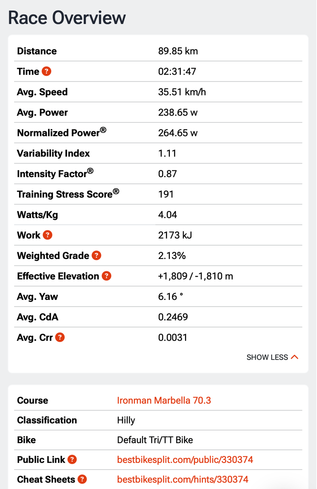
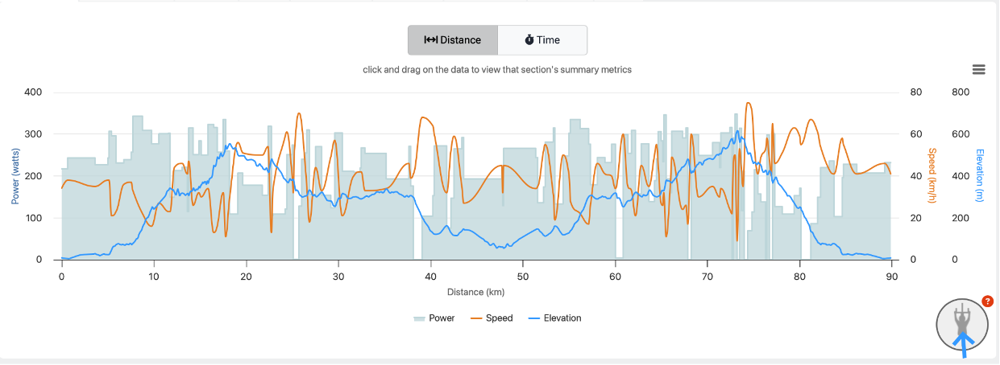
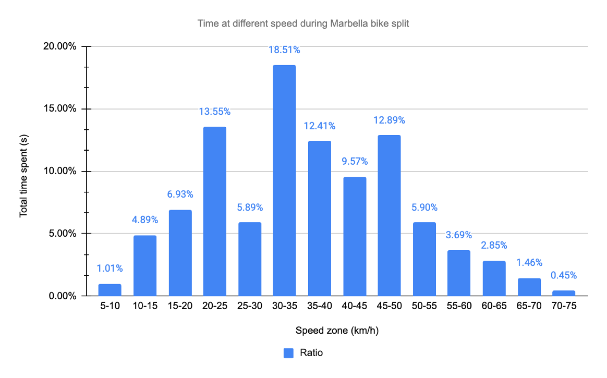
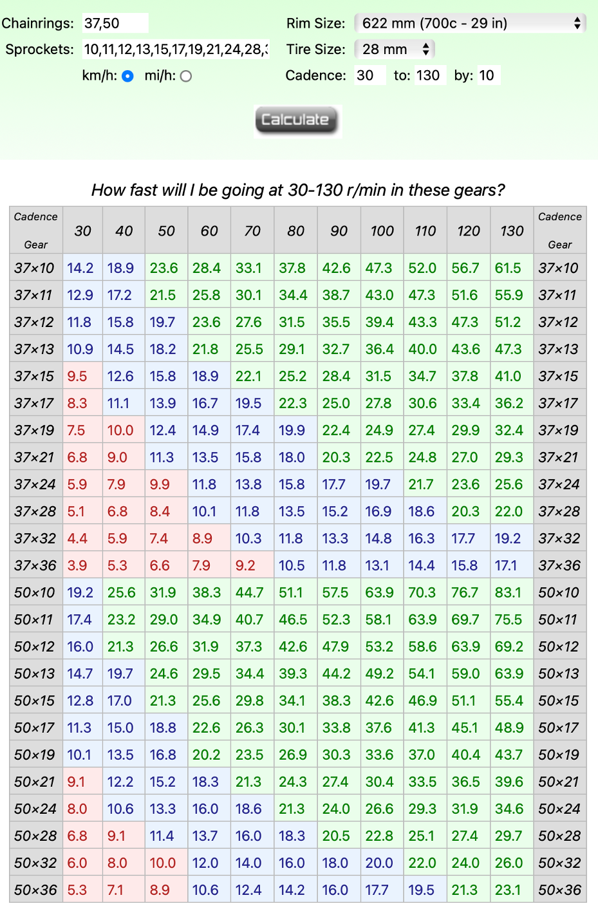
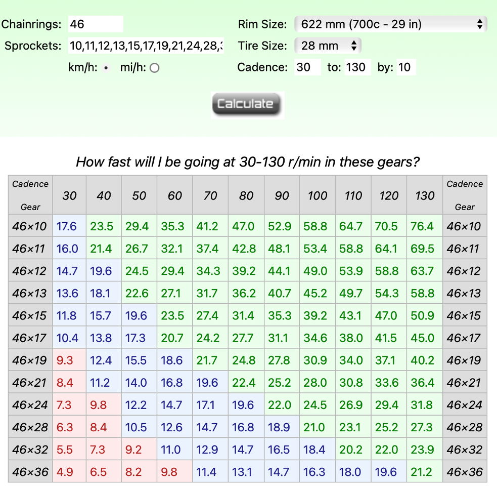
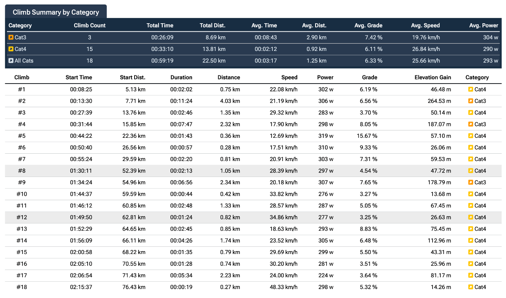

# **Case Performance Scientist**

**Due date : 29/09 8pm**

## **Ironman 70.3 Worlds Championships**

A triathlete has qualified for the IRONMAN 70.3 World Championships in
Marbella (November 8, 2025).

After finishing 8th in Lahti in 2023, she is now aiming for the best
possible performance at Worlds.

She needs your help with:

1.  Assessing her physiological profile, strengths, and weaknesses based on her Lahti race

2.  Identifying mistakes that could ruin her race

3.  Choosing the right equipment: wheels suited for the Marbella course, appropriate gearing

4.  Developing a race and/or overall pacing strategy to achieve the best possible time depending on the course and weather

#### **Do you think you could support her on these points?**

Deliverables: A race briefing in the format of your choice + a GitHub
repo

## 1.  **Assessing her physiological profile, strengths, and weaknesses based on her Lahti race**

Based on the IM Lahti 70.3 results, the 8th female triathlete is Amelia
Watkinson.

### **Strength and weaknesses**

Taking data from
[endurance-data.com](http://endurance-data.com), we can
first compare Amelia's splits to her opponents. This will provide
information about her strengths and weaknesses.

Amelia is in red at the center, then we have

-   Blue : Laura Philipp, 6th

-   Pink : Marjolaine Pierre, 7th

-   Yellow : Daniela Ryf, 9th

-   Turquoise : Anne Reischmann, 10th

Sport by sport analysis :

-   **Swim** : Amelia gets out of the water in 29th position and we can
    see that her opponents are faster except for Reischmann. If we
    look at her athlete history, swimming was less of a foundation
    early on compared to running and cycling. **Overall the swim is a
    weakness.**

-   **Bike** : She makes the 7th bike split, so she's a strong rider.
    Looking at recent
    [interviews](https://www.triathlete.com/culture/people/amelia-watkinson-rising-triathlon-star/?utm_source=chatgpt.com%3Futm_source%3Dchatgpt.com)
    (Lacke, triathlete.com, 2025), Amelia appreciate scenic courses,
    *"there is so much more beauty and experiences in the valleys and
    on the mountain tops, than forever stuck on the plains"*, so the
    Lahti bike course might not her full potential on the bike. The
    Marbella course would certainly suit her more.

**Overall the bike, especially on hilly course, is probably her main
strength**

-   **Run** : She gets the 12th run of the day. However when we look at
    the running splits of her direct opponent, they almost all have
    better running splits. It could be that Amelia is too strong on
    the bike and that will affect her running performance. Also coming
    from a national running background, she may have put less focus on
    the run in training.

 **Overall the run is a small weakness in this race**, but it may
 results of a poor management of the effort on the bike

-   **Transitions** : Transitions at pro level are often already perfect
     and Amelia is indeed great at transitions, getting consistent
     times with her opponents. The only significant gap is for T2 where
     Knibb (#1st) is 35% faster. This accounts for 20 lost seconds,
     which in this race would have placed Amelia in 7th.

**Overall transitions are a strength** but there is room for
improvements still.

### **Physiological profile**

Taking the course in Lahti we can infer the following physiological for
Amelia

**SWIM**

Assuming there is no current in Lake Vesijarvi (it's famous for its calm
waters), the 70.3 swim pace of Amelia is **1:25 min per 100m**.

We can extrapolate this value to get her swimming threshold pace.
Assuming an intensity index of 0.90 (usual IF for pro female triathlete
swim), this puts her swimming threshold pace at **1:16 min per 100m**

**BIKE**

For this calculation, I used the computational engine from
[bestbikesplit.com](http://bestbikesplit.com). I modeled
Amelia like so :

Athlete height : 170 cm

Athlete weight : 58 kg

Experience : Pro/Elite

*Based on PTO athlete information.*

Bike : Trek Concept SLR

Bike weight (estimated) :8.70 kg

Front Wheel : 60mm

Back Wheel : Disc

Tires : GP5000

Tire Type : Clincher (wide 25-28)

Tube Type : Latex

Riding style : Aeorbars (Elite/pro TT)

Climbing position : Hoods/Bullhorns

Helmet Type : Aero

*Based on Amelia's Instragram.*

I used Basic Riding Style.

This gave me these values for her estimated CdA on the bike :

| Yaw Angle | CdA   |
|-----------|-------|
| 0°        | 0.238 |
| 5°        | 0.2351|
| 10°       | 0.2238|
| 15°       | 0.2195|
| 20°       | 0.2118|

I then ran the race simulation, with an adjusted weight of 1kg to
account for the water and nutrition.

I adjusted the weather conditions to match the race and chose to use the
Normalized Power Model for the simulations.

I then made several simulations, adjusting the race goal watts to make
the total time match Amelia's time of 02:11:13 via the dichotomous
method

| Simulation | Simulated Bike Time | Race Goal Watts |
|------------|---------------------|-----------------|
| #1         | 02:10:51            | 270             |
| #2         | 02:11:45            | 265             |
| #3         | 02:11:23            | 267             |
| #4         | 02:11:12            | 268             |

I kept simulation #4, giving me a this race overview

The complete simulation and the parameters are
[public](https://www.bestbikesplit.com/public/330374) and
can be accessed for more details.

Based on the simulation, **I estimate her IM 70.3 normalized power at
267 W** **and her FTP at 307 W (calculated from the IF).**

**RUN**

The Lahti course has around 210m of elevation, with a smooth transition
between gradients. This context suits well for computing a grade
adjusted pace for Amelia's race.

I didn't use Bikebestplit as the way they simulate descents on the bike
is completely different from the way it works when running.

I didn't find a .fit file of her activity so I used her splits from
Endurance Data and the Strava activity of Kat Matthews that same day to
get a .gpx file.

I applied a simple GAP model to the pace between each split. The details
of the algorithm I created are in the python notebook GAP-model.ipynb.

For each split, I now have an adjusted pace taking the gradient into
account. Averaging the GAP, I get a value of 3:47 min/km

The GAP value from Matthews on strava is 3:33 min/km for a 1:16:22
half-marathon which is 6.0% faster than Amelia. If we compare the two
GAP values (3:47 min/km for Amelia) we get a 6.2% difference, showing
that my simple model is accurate enough.

Based on the computation, **I estimate her IM 70.3 run pace at 3:47
min/km** and if we consider a Intensity Factor of 0.89, **we can
estimate her Threshold Pace to 3:22 min/km**.

**Here is her physiological profile summed up :**

| Metric              | Value          |
|---------------------|----------------|
| Swim TP             | 1:16 min/100m  |
| Bike FTP            | 307 W          |
| Run TP              | 3:22 min/km    |
| Swim IM 70.3 pace   | 1:25 min/100m  |
| Bike IM 70.3 power  | 267 W          |
| Run IM 70.3 pace    | 3:47 min/km    |

From these values, we could derive the training zones for her training,
but as the exercise is to prepare only the next race, I will focus only
on the IM 70.3 intensities.

PS : I didn't find any heartrate value to match the corresponding
intensity so I would not consider it for the Marbella IM 70.3
Championships.

## 2.  **Mistakes that could ruin her race**

Without knowing how she usually races and following her training day to
day, it is ambitious to give realistic assumptions on her potential
mistakes. However, with the data from Lahti here are the probable
mistakes she could make at the Marbella IM 70.3 Championships.

-   Overbiking the Marbella course

Given she is a strong rider that loves hilly courses, she could go too
hard on the bike, spiking power in hills or losing control in the
technical downhills. This could ruin her run or even end her race if she
crashes on the descents.

-   Heat management

Even in November, Marbella's weather is sunny with around 21°C. As
Marbella is situated along the Spain coast, it could be quite humid,
making the apparent temperature closer to 25°C. This is much warmer than
Lahti. If she isn\'t prepared for heat and doesn't adjust her drinking
strategy, she will probably suffer from the heat on the run.

-   Pre-race media solicitation

Given she placed 8th in the world, she will have the media asking for
interviews or podcasts during race week. This is a stress for athletes
who should rest before the race and keep their mind focused for the
rest.

-   Wrong gearing choice

Having the wrong gearing would result in producing more lactate on the
climbs or not being able to put power in the descents. This point will
be addressed later so I hope she won't make any mistake about it.

## 3.  **Choosing the right equipment**

### **In the water**

According to the official ironman website, the average water temperature
is 16°C. The swimsuit might not be mandatory, but highly recommended.
With a race starting around 7:45am, the sun will emerge from the horizon
in the middle of the swim (run rise at 8:12am). It will create glares
and make navigation harder. Depending on the exact start time of Amelia
(it's a rolling start), she could even be finished before sunrise. The 2
last segments of the swim are oriented to SW and NW so she won't be
affected by the glaring.

**Overall I suggest wearing a swimsuit and clear goggles to provide a
good vision before sunrise.**

### **On the bike**

Running the bestbikesplit simulation on the Marbella course gives the
following results. I kept the same parameters as the Lahti course, and
used the estimated IM 70.3 power.

Amelia will likely have an average speed of around 35.5 km/h but with
this mountainous course, she will have to change gears a lot. Her
maximum speed is estimated to be around 70-75km/h, while her slowest
speed will be about 9km/h.

If we plot the repartition of time spent at different speed values, we
can see that she will spend quite some time (15% of total bike time)
below 20 km/h, including 1% between 9 and 10 km/h. Therefore small gears
will be mandatory to keep the cadence in the 80-100 rpm range. We can
consider the smallest gear at 10km/h and 80 rpm, giving her the
possibility to slow cadence even more to get as low as 9km/h in the
steepest sections.

On the other hand, she will spend another 15% above 50 km/h, showing the
need for bigger gears to put power on the pedals. We will consider the
biggest gear at 70 km/h and 110 rpm. For the descents, maintaining a
good trajectory and aero position will help much more than pushing hard
on the pedals.

Based on her Instagram photos, Amelia rides a SRAM RED AXS groupset,
which gives her the opportunity to use a 10-36T or a 10-33T cassette
with a 37-50T crankset. I would recommend the 10-36T as it provides a
32T that will help keep the chain centered, compared to the 10-33T that
only provides a 28T as second gear.

In my opinion a single chainring does not provide the polyvalence needed
for this course. Here the table for a 46T single chainring from SRAM.

**Overall, I suggest using the SRAM RED AXS etap 37-50T double chainring
with a 10-36T cassette.**

For the wheels, Amelia used a 60mm wheel at the front and a lenticular
at the back for Lahti.

I have run both disc and 60mm in the bestbikesplit simulation and the
disc wheel setup is the fastest. That said, the gap is 0.02 km/h in
total, she will only lose 7 seconds so I would recommend choosing the
60mm wheels. It will be easier to handle the bike in technical descents
and in case of a windy day, which is quite probable in this location, it
will help holding a good aero position.

**Overall, I suggest using 60mm wheels at the front and back.**

### **On the run**

The running conditions will be pretty classic, so her usual equipment
will be fine. Sunglasses are definitely recommended if the sun is out.

## 4.  **Race pace strategy for Marbella**

### **Pacing strategy**

#### **Swim**

For the race pace at Marbella, Amelia should be able to maintain her
pace from Lahti. She has likely improved in the water since 2023, but
since the swimming is in the sea, waves and swell will make it a bit
harder.

**[Here](https://docs.google.com/spreadsheets/d/1Zdydq8krNZ-YE1xYeLJSHEeJKExHrRgXpSDr3W5NNX8/edit?gid=1501865030#gid=1501865030) are the splits for each buoy of the course.**

However, Amelia is racing for the best results possible, the strategy
should be to not pay too much attention to the splits, and making sure
to stay in contact with other swimmers drafting in the feet of her
opponents. Looking at the watch in the middle of the swim will slow her
down.

**The objective swimming pace objective is set to 1:25 min/100m for a
total swim time of 27:16**

#### **Bike**

The bike pacing strategy will be based on the bestbikesplit simulation
used for the gearing and wheels recommendations.

**The normalized power objective is set to 267 W and that will equate to
a 02:31:54 bike split.**

**The simulation give the following provisional power and speed
[plan](https://docs.google.com/spreadsheets/d/1Zdydq8krNZ-YE1xYeLJSHEeJKExHrRgXpSDr3W5NNX8/edit?gid=761149379#gid=761149379)
for homogeneous segments of the bike course.**

It also provides a climb cheatsheet to help dealing with the hills.

#### **Run**

Based on the gpx file and the IM 70.3 race pace of Amelia we can set the
objective of running the same GAP as Lahti. **This gives the
[following](https://docs.google.com/spreadsheets/d/1Zdydq8krNZ-YE1xYeLJSHEeJKExHrRgXpSDr3W5NNX8/edit?gid=1382714756#gid=1382714756)
pacing plan, leading to a 01:19:24 half-marathon.**

From all this data we can construct a race briefing for Amelia, tuning
the parameters depending on her training data and feeling during key
sessions. Without this information it is not a good idea to make
assumptions on what pace or power Amelia should target.

However, if we consider that she will aim for the podium, I would put
the emphasis on

-   Swimming faster, ideally a 26:30 swim will place her closer to the
     head of the race

-   Keeping the bike effort the same, hilly courses are her strength so
     she will be able to produce a fast time of around 02:30 without
     compromising the run.

-   Running faster, ideally a sub 01:18 half-marathon to be competitive
     enough

### **Nutrition & Hydration**

To achieve a podium in IM 70.3 Championships it is mandatory to have a
great nutrition and hydration strategy.

To optimize her performance, Amelia should aim for 100-120g of
carbohydrates (CHO) per hour of effort. Here are my recommendations :

-   Swim : 45g gel on the start line

-   Bike : 1.5L to 1.75L of water with electrolytes + 300g of CHO (2x80g
     drink mixes and 4x40g gels)

-   Run : 2x30g gels 2x 40g gels, 500mL of electrolytes + more
     electrolytes in the aid station if needed

However nutrition is quite personal and without knowing her preferences,
the nutrition and hydration plan will have to be.

### **Race briefing for Amelia**

For the first 300m of the swim, focus on getting your swim right,
understand the level of your direct opponent, and try to find good feet
to follow. You may check your pace at the first buoy just to make sure.
Then once you find your rhythm, don't overthink it and keep the effort
really smooth. Start thinking about the transition in the 200m last
meters.

In T1, do the usual stuff, stay calm and focus, you know what to do.

On the bike, aim for 260-270 watts on the flats and keep the power below
300 watts if the gradient is below 7%. In the steepest parts you can
push up to your FTP if you feel great. There are really steep hills over
15% at km 17.5, 65.5 and 73. Try taking gels during the ascents and
fluid during the descent, to ensure a smooth intake of CHO. When you get
fast in the descent, forget the power and focus on your aero position
and bike handling. Any watt saved by a good position keeps the energy in
for the run part.

For T2, same as T1, keep it classic focusing on your opponents around
you.

On the run, aim for 3:45 pace on the flats. The hills will force you to
slow down to maintain a smooth effort and you can slow to around
4:00-4:10 when the slope increases. There is 1 major downhill in the run
loop (5% at km 4), where you can increase speed up to 3:20-3:15.

This pacing plan is a great place to start, but depending on your form
that day, you may adapt the paces by 5 to 10 seconds, especially if its
really hot.
